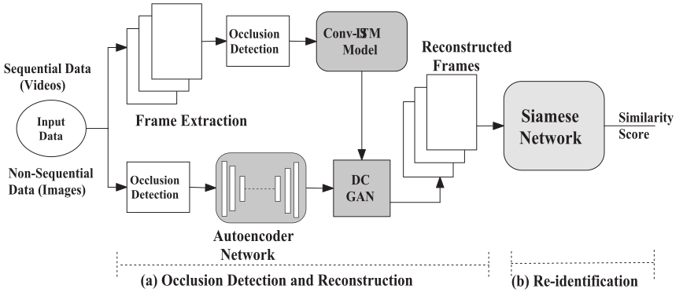

# Person Re-identification in Presence of Occlusion

This is the official code release for the paper titled: 
### Person Re-identification in Presence of Occlusion

##### Overall framework of the proposed Multi-Model approach. Re-identification is performed in two steps, 
##### (a) the occlusion detection and reconstruction followed by (b) Siamese Network based prediction.

 
Person Re-identification has been one of the crucial areas which received significant attention over the past few years. Automation of surveillance systems with high precision in monitoring under different scenarios is necessary.  Most of the current systems fail in the presence of occlusion. Hence, we propose an approach that is robust and accurate even in the presence of occlusion. We initially detect if a given frame is occluded. If there is an occlusion, we employ ConvLSTM to reconstruct the occluded pixels for sequential data(video) to capture the spatio-temporal features from the previous frames, which results in improved reconstruction. For non-sequential data, we employ an Autoencoder. 
Finally, to fine-tune the reconstructed frames, we use a DC-GAN on top of both ConvLSTM & Autoencoder. This reconstruction strategy significantly improved Rank-1 reidentification accuracy on several publicly available datasets compared to other state-of-the-art techniques.

#### (a) Sequential Data(Videos): [Occlusion Detection ---> ConvLSTM + DC-GAN]

Sample ground-truth unoccluded sequential frames (first row), frames with synthetic occlusion (second row), reconstruction using **Conv-LSTM** (third row), and fine-tuning using **DC-GAN** (fourth row), 

#### (b) Non-Sequential Data(Images): [Occlusion Detection ---> Autoencoder + DC-GAN]

Sample ground-truth unoccluded non-sequential frames (first row), frames with synthetic occlusion (second row), reconstruction using **Autoencoder** (third row), and fine-tuning using **DC-GAN** (fourth row)

